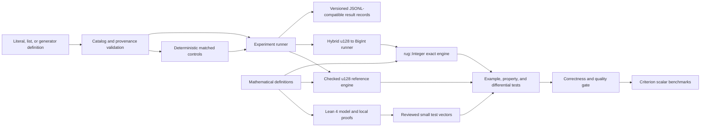

# Collatz Lab Architecture

- **Status:** Accepted baseline; PBI-001 and PBI-002 implemented
- **Date:** 2026-08-02
- **Phase:** Incremental MVP implementation

## Purpose and boundaries

Collatz Lab is a local, scalar research tool for reproducible Collatz
experiments on selected inputs. Its correctness core consists of a mathematical
authority, a Lean 4 reference model, a checked `u128` Rust engine, and an
arbitrary-precision Rust engine backed by `rug::Integer` and GMP.

The initial runtime target is macOS Apple Silicon (`aarch64-apple-darwin`). The
MVP accepts individual numbers, lists, and supported generator definitions;
records provenance and configuration; compares special values with
deterministic bit-length-matched controls; and writes line-oriented results for
later analysis.

Mass interval scanning, SIMD, GPU, distributed execution, a GUI, a network
service, and a server database are outside the architecture.

## System context



Lean is a design-time verification component. It is not a runtime dependency.
Benchmarking consumes only implementations that have passed the relevant proof
and correctness gates.

## Repository boundaries

```text
crates/collatz-engine/       mathematical Rust contract, pure MVP generators,
                             metrics, reference, BigInt, and hybrid execution
crates/collatz-experiments/  number definitions, provenance, controls,
                             experiment configuration, and result records
crates/collatz-cli/          minimal local command-line entry point
lean/                        Lean 4 project and local mathematical theorems
test-vectors/                reviewed fixed values shared by conformance tests
specs/collatz-engine/        single living MVP specification
tasks/                       transient ASDLC implementation deltas
docs/adrs/                   immutable architectural decision history
research/                    logbook, experiment plan, and small result summaries
```

PBI-001 established `lean/`; PBI-002 established the Rust workspace and checked
reference engine. The remaining directories describe accepted ownership, not
authorization to implement later PBIs: PBI-003 adds arbitrary precision and
promotion, while PBI-004 adds the first catalog-driven experiment flow.

## Mathematical and formal layer

[`docs/mathematical-definitions.md`](docs/mathematical-definitions.md) is the
human-readable authority for steps, iteration, compression, metrics,
generators, and verified-bound semantics. The planned Lean modules mirror
specific obligations:

```text
lean/
  lakefile.toml
  lean-toolchain
  Collatz.lean
  Collatz/
    Basic.lean
    Iteration.lean
    Accelerated.lean
    SpecialForms.lean
    Generators.lean
    TestVectors.lean
```

- `Basic.lean` defines the classical step and elementary parity/positivity
  lemmas.
- `Iteration.lean` defines iteration, trajectories, reachability, and counting.
- `Accelerated.lean` defines accelerated and compressed steps plus their
  correspondence to classical iteration.
- `SpecialForms.lean` proves the `a * 2^m - 1` identity and Mersenne corollary.
- `Generators.lean` defines MVP generators.
- `TestVectors.lean` checks small formal examples.

PBI-001 may keep a module small, but the names and ownership above prevent
unrelated proof responsibilities from being mixed.

Lean proves properties of the mathematical model. It does not verify the
compiled Rust program, the Rust compiler, `rug`, GMP, CLI parsing,
serialization, operating-system behavior, memory management, or performance.
Conformance between Lean statements and Rust remains a review and testing
obligation.

## Engine contract

All engines use the classical step and runner ordering in the mathematical
authority. The conceptual operations are:

- `step(value)` — one classical transition or a typed outcome;
- `run(start, classical_step_limit)` — a finite observation with metrics;
- compressed execution — an internal or explicit mode whose accumulated
  weights and peak accounting reproduce the classical observation.

A run summary preserves the numeric value type and records start, last
represented value, completed classical transitions, compressed iterations when
used, observed peak, first descent when observed, promotion count, limits, and
termination reason.

### Run-state ordering

For a valid positive current value:

1. if it is `1`, return `reached_one` without another transition;
2. if the completed classical-transition count equals the limit, return
   `step_limit_reached` at the current value;
3. if another operational limit is reached, return its typed status without
   changing mathematical counters;
4. attempt exactly one permitted classical transition or a compression that
   fits the remaining classical-step budget;
5. in the reference engine, a checked-operation failure returns arithmetic
   overflow at the last represented value without incrementing the counter;
6. in the hybrid runner, promote the current value before that operation and
   then execute the same transition exactly;
7. record the new value and derived metrics, then repeat.

Peak values include the start and every successfully reached classical value.
Compressed execution additionally accounts for skipped intermediate values as
specified mathematically.

### Checked `u128` reference engine

- Implemented by `crates/collatz-engine/src/reference.rs`, with public domain
  and result types in `crates/collatz-engine/src/domain.rs`.
- Stores values as `u128` and uses checked arithmetic.
- Reports overflow as data; it never wraps, saturates, or panics on domain
  arithmetic.
- Does not promote, preserving a bounded and simple Rust reference.
- Supplies fixed-example, boundary, and common-domain differential evidence.

### Arbitrary-precision engine

- Stores engine values as `rug::Integer` for the complete execution.
- Uses exact arithmetic and the same stopping and accounting rules.
- Has no arithmetic-overflow result, while finite operational limits remain.
- Is implemented independently enough to make differential testing meaningful.

### Hybrid runner

- Starts in `u128` only when the input is representable.
- Checks the next odd operation before executing it.
- Promotes the current value to `rug::Integer` before overflow, then continues
  without repeating or losing a transition.
- Promotes at most once and reports that promotion.

## Experiment contract

The experiment layer owns declarative number definitions, provenance,
configuration, matched-control generation, orchestration, and result records.
It does not reimplement Collatz arithmetic.

The MVP data flow is:

1. parse a literal, ordered list, or supported generator definition;
2. reconstruct and validate each positive integer plus provenance;
3. derive exact bit length and decimal digit count;
4. create deterministic matched controls from a declared algorithm and seed;
5. execute every input under the same declared engine policy and limits;
6. serialize one versioned result record per observation;
7. retain configuration and hashes needed for reproduction.

Large values and trajectories remain outside Git. Small summaries and metadata
point to large artifacts by SHA-256. No automatic network download or record
publication belongs to the MVP.

## Dependency direction

- Mathematical definitions constrain Lean, engine contracts, and metric names.
- Lean modules depend only in the order `Basic -> Iteration -> Accelerated ->
  SpecialForms/Generators -> TestVectors`, with imports minimized to actual
  needs.
- The reference and BigInt engines depend on a shared domain contract; neither
  calls the other at runtime.
- The hybrid runner may compose the two representations without changing their
  standalone semantics.
- The experiment crate depends on the public engine contract; engines do not
  depend on catalogs, JSONL, CLI, or research storage.
- The CLI depends on experiment orchestration and has no domain arithmetic.
- Tests and benchmarks may depend on both engines. Production engine modules do
  not depend on property-test, mutation-test, or benchmark tooling.

## Correctness and quality architecture

The evidence layers are complementary:

1. mathematical definitions and manual review;
2. Lean local proofs with no `sorry` or `sorryAx` dependency;
3. independent fixed examples;
4. Rust unit and property tests;
5. common-domain and promotion differential tests;
6. constrained mutation testing of the reference module;
7. independent reproduction for exceptional experiment results.

The exact MVP commands and thresholds are authoritative in
[`docs/quality-strategy.md`](docs/quality-strategy.md). Proof and correctness
gates run before benchmarks are interpreted.

## Performance and deployment architecture

Criterion supplies scalar CPU microbenchmarks and bounded-run benchmarks on
Apple Silicon. Inputs, limits, toolchains, machine context, and timing region
are declared. The numeric engines are reported separately. No performance
target is asserted before measurement.

The MVP is a local process with file input/output. It deploys no service and
requires no server database. GMP affects build and portability as recorded in
[ADR-003](docs/adrs/ADR-003-arbitrary-precision-with-rug-and-gmp.md).

## Evolution rules

Observable behavior changes update the living Spec in the same change.
Definitions change only with human approval and corresponding Lean/test updates.
Significant choices receive an ADR; changed decisions supersede rather than
rewrite accepted history. Every future optimization must preserve reference
results and step accounting and must carry a proof, a formalized justification,
and differential regression evidence appropriate to its claim.
