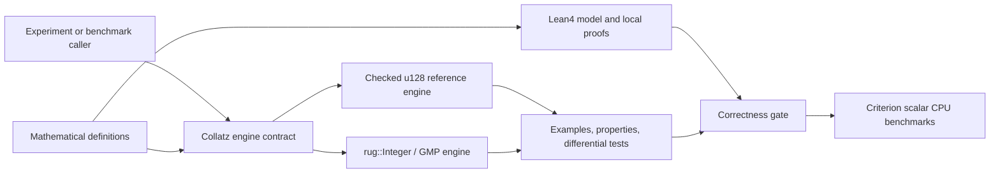

# Collatz Lab Architecture

- **Status:** Proposed baseline
- **Date:** 2026-08-02
- **Phase:** Design only; production implementation has not started.

## Purpose

Collatz Lab provides a small, auditable execution core for the standard Collatz
map. Its primary goal is mathematical and implementation correctness. It uses a
bounded `u128` engine as the reference Rust implementation and an independent
`rug::Integer`/GMP engine for arbitrary-precision execution and differential
checking.

The first supported runtime is `aarch64-apple-darwin`. Execution is scalar CPU
code. Performance work begins only after the mathematical model, proofs, and
behavioral tests are green.

## System context



Lean4 is a design-time verification component, not a runtime dependency of the
Rust engines. Benchmarking consumes only implementations that have passed the
proof and correctness gates.

## Planned repository boundaries

```text
crates/collatz-engine/     Rust engine contract and the two implementations
proofs/                    Lean4 definitions and local theorems
benches/                   Reproducible Criterion workloads
specs/collatz-engine/      Living feature specification
tasks/                     Transient ASDLC execution deltas
docs/adrs/                 Immutable architectural decision history
docs/mathematical-definitions.md
                           Human-readable mathematical authority
```

The exact Rust and Lean file layout is established by PBI-001. The boundaries
above are architectural ownership boundaries, not authorization to add
production behavior during bootstrap.

## Engine contract

Both engines implement the same conceptual operations:

- `step(value)` computes exactly one unaccelerated Collatz transition.
- `run(start, step_limit)` evaluates a finite prefix and returns a summary.
- A run summary records its start, last represented value, completed transition
  count, peak represented value, and termination reason.

The contract is generic over the numeric representation. Public result shapes
must preserve the engine's value type; conversion through a narrower shared
integer type is not part of the architecture.

### Run-state ordering

For a valid positive start, a run observes these states in order:

1. If the current value is `1`, return `ReachedOne` without another transition.
2. If the completed transition count equals `step_limit`, return
   `StepLimitReached` at the current value.
3. Attempt one transition. A checked-`u128` failure returns
   `ArithmeticOverflow` at the last represented value without incrementing the
   transition count.
4. Record the new value and repeat.

Consequently, `run(1, 0)` reaches one in zero transitions, while `run(6, 0)`
returns a zero-transition limited prefix. Peak values include the start and all
successfully reached values, never an unrepresentable overflow result.

### Engine responsibilities

**Checked `u128` reference engine**

- Represents values directly as `u128`.
- Uses checked operations for the odd branch.
- Reports overflow as data rather than wrapping or panicking.
- Serves as the bounded Rust reference for examples and differential tests.

**`rug::Integer`/GMP engine**

- Represents every engine value as `rug::Integer`.
- Applies the same single-step and run accounting rules exactly.
- Has no arithmetic-overflow outcome; finite step limits still bound every run.
- Remains algorithmically independent enough for meaningful differential
  checks against the reference engine.

## Correctness architecture

### Mathematical layer

[`docs/mathematical-definitions.md`](docs/mathematical-definitions.md) defines
the standard map, trajectories, limits, counts, peaks, and representability.
Lean4 mirrors those definitions over positive natural numbers and proves local
obligations such as positivity, parity of the odd result, decrease of the even
branch above one, and consistency of transition accounting.

Lean4 does not prove that every positive starting value reaches one. That claim
is the Collatz conjecture and is outside the project contract.

### Executable layer

Rust correctness is supported by four complementary test classes:

1. Fixed mathematical examples, including starts `1`, `6`, and `27`.
2. Property-based checks of branch formulas and run invariants.
3. Differential tests between both engines whenever the complete observed
   prefix is representable as `u128`.
4. Boundary tests for zero, zero-length prefixes, and `u128` overflow.

Because the Rust implementation is neither extracted from Lean nor verified by
a Rust semantics in Lean, the proof claim is deliberately limited: Lean proves
the mathematical model; executable tests establish conformance of the Rust
implementations to that model.

## Performance architecture

- Criterion provides reproducible scalar CPU microbenchmarks and bounded-run
  benchmarks on Apple Silicon.
- Benchmark cases use declared inputs, step limits, toolchain versions, and
  Criterion configuration.
- The two numeric engines are reported separately; their different numeric
  representations are part of the result context.
- Benchmark output is evidence, not an acceptance oracle. No initial throughput
  target is asserted without measurement.
- The execution model excludes explicit SIMD and GPU compute. Parallel search
  and distributed execution are also outside the initial architecture.

## Dependency direction

- Mathematical definitions constrain the Lean model and the Rust engine
  contract.
- Both Rust engines depend on the shared contract; neither engine depends on
  the other at runtime.
- Differential tests and benchmarks depend on both engines.
- Production engine modules do not depend on property-testing or benchmark
  libraries.
- Experiment front ends, persistence, visualization, networking, and a CLI are
  outside the initial engine boundary.

## Evolution rules

The feature Spec is living state and changes with behavior. Significant choices
that require rationale and alternatives receive immutable ADRs under
[`docs/adrs/`](docs/adrs/README.md), following the local
[`ADR Authoring` practice](.asdlc/practices/adr-authoring.md). A changed
decision supersedes an earlier ADR rather than rewriting its history.
